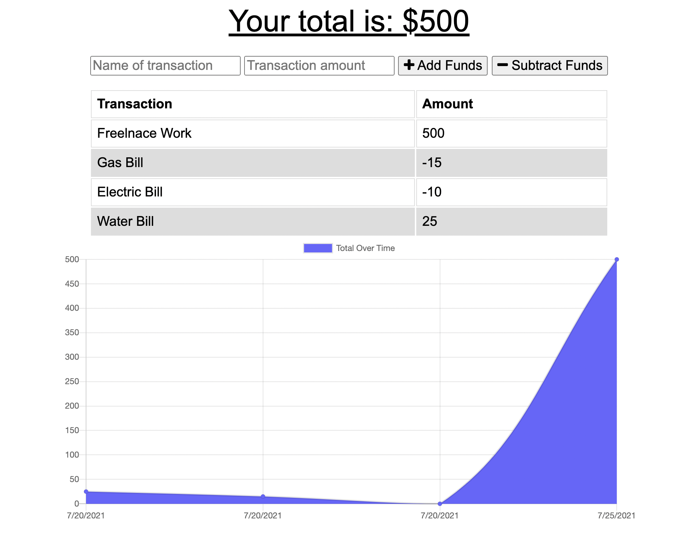

# Budget Tracker - Progressive Web Application

## Description

This budget tracker is a progressive web application that allows you to manage your monthly bills and payments.

## What did I do?

- Used the express server
- Used mongoDB and mongoose for the database
- Used the Mongoose create method to allow users to insert a transaction
- Used the Mongoose insertMany method to allow users to bulk insert transactions
- Used the Mongoose find and sort methods to allow users to view their most recent transactions
- Used a service worker to allow parts of the website to be cached and viewed offline

## Usage & Installation

Feel free to clone my repo and do a npm i to install all of the necessary packages. Once you have installed the packages, type npm run dev to see the app in action.

## License

MIT

## Screenshots

## Link to deployed application:

https://workout-tracker-2021.herokuapp.com/
